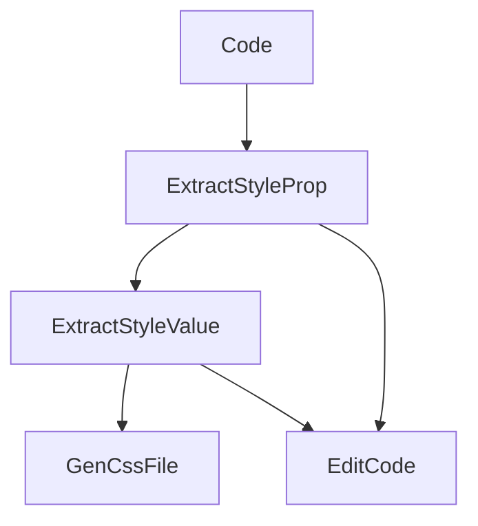

## Extractor

jsx to css extractor

### Example

Before

```tsx
<Box bg="red" color="white" m={2} p={2} textAlign={variable}>
  Hello World
</Box>
```

After

```tsx
<Box
  className="dp1 dp2 dp-3 dp-4 dp-v"
  style={{
    '--ta': variable,
  }}
>
  Hello World
</Box>
```


