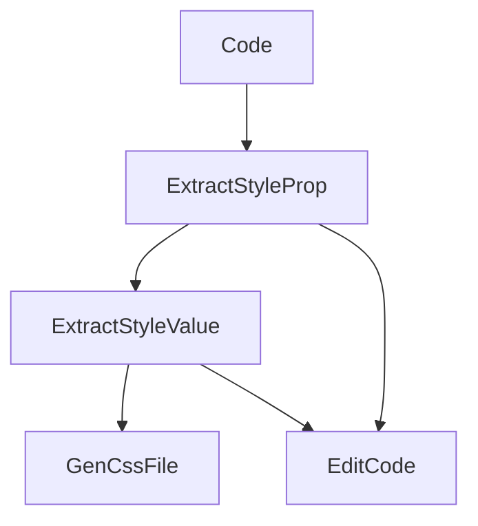

## Extractor

jsx to css extractor

### Example

Before

```jsx
<Box bg="red" color="white" p={2} m={2} textAlign={variable}>
    Hello World
</Box>
```

After

```jsx
<Box className={"dp1 dp2 dp-3 dp-4 dp-v"} style={{
    "--ta": variable,
}}>
    Hello World
</Box>
```

