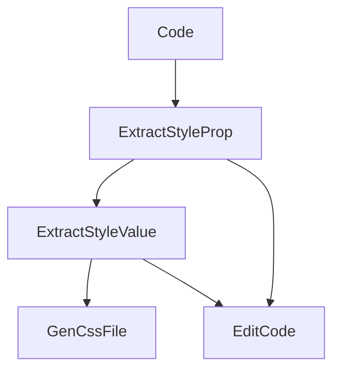

## Extractor

Build-time JSX to CSS extractor. Static styles become atomic classes; dynamic
style values are passed through CSS variables on the native element.

### Example

Standalone input (with the build plugin configured):

```tsx
import { Box } from '@devup-ui/react'

function Example({ variable }: { variable: 'left' | 'right' }) {
  return <Box bg="red" color="white" m={2} p={2} textAlign={variable}>
    Hello World
  </Box>
}
```

Extracted code from an isolated run with an empty theme (`{}`) and the default
prefix. Generated class and variable names depend on extraction state and prefix.

```tsx
import "@devup-ui/react/devup-ui.css";
function Example({ variable }: {
	variable: "left" | "right";
}) {
	return <div className="a b c d e" style={{ "--f": variable }}>
    Hello World
  </div>;
}
```

Generated CSS:

```css
/*! devup-ui v1.0.82, | Apache License 2.0 | https://devup-ui.com */.a{background:red}.b{color:white}.c{margin:8px}.d{padding:8px}.e{text-align:var(--f)}
```


```mermaid
graph TD
;
    Code --> ExtractStyleProp;
    ExtractStyleProp --> ExtractStyleValue;
    ExtractStyleValue --> GenCssFile;
    ExtractStyleValue --> EditCode;
    ExtractStyleProp --> EditCode;
```
